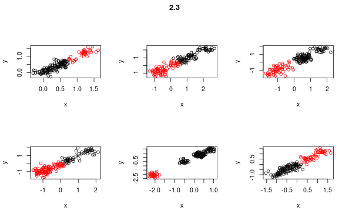

<h1 align="center">Big Data Application Homework 1</h1>
<p align="right">r01922060 顧廷緯</p>

### MapReduce
#### Problem 1
- **Mapper**: A procedure that receives `a record` and outputs `one or more (key, value) pairs`.
- **Reducer**: A procedure that receives `a (key, values of the key)` and outputs `one or more (key, value) pairs`.
- **Combiner**: A procedure that combines output data of mapper at a local machine before sending to shuffler.

#### Problem 2
Within each iteration, perform the following actions:
```
Mapper
======
Input:
  - (x, y) (a data point)
  - i (number of iteration)
Process: 
  - Load current w.
  - gradient = (y * x) / (1 + exp(y * MatrixMulti(w * x))
Output: (i, gradient)

Reducer
=======
Input: (i, gradients)
Process:
  - Load current w.
  - w -= LEARNING_RATE * sum(gradients)
Output: (i, w)
```

### Analytics Overview
#### Problem 1
- **Supervised Learning**: Learning from `labeled data` only.
- **Unsupervised Learning**: Learning from `unlabeled data` only.
- **Semi-supervised Learning**: Learning from both labeled (usually little) and unlabeled data.
#### Problem 2
Because the outcome of tossing a coin is random (assume it is a fair coin).

#### Problem 3
- **Classification Problem**: The type of prediction target is category.
- **Regression Problem**: The type of prediction target is real value.

### Clustering
#### Problem 1.  

Initial centers: center 1 is (1, 1); center 2 is (4, 2)  
Iteration 1:

Point | Distance to center 1 | Distance to center 2 | Nearest
------|-----------------------------|-----------------------------|---------
(1,1) | 0 | sqrt(10) | center 1
(1,3) | sqrt(4) | sqrt(10) | center 1
(2,2) | sqrt(2) | sqrt(4) | center 1
(3,1) | sqrt(4) | sqrt(2) | center 2
(3,2) | sqrt(5) | sqrt(1) | center 2
(3,3) | sqrt(8) | sqrt(2) | center 2
(3,5) | sqrt(20) | sqrt(10) | center 2
(4,2) | sqrt(10) | sqrt(0) | center 2
(4,4) | sqrt(18) | sqrt(4) | center 2

New center 1: (1 + 1 + 2, 1 + 3 + 2) / 3 = (4/3, 2)  
New center 2: (3 + 3 + 3 + 3 + 4 + 4, 1 + 2 + 3 + 5 + 2 + 4) / 6 = (10/3, 17/6)

--

Iteration 2:

Point | Distance to center 1 | Distance to center 2 | Nearest
------|-----------------------------|-----------------------------|---------
(1,1) | 1.05 | 2.97 | center 1
(1,3) | 1.05 | 2.34 | center 1
(2,2) | 0.67 | 1.57 | center 1
(3,1) | 1.94 | 1.86 | center 2
(3,2) | 1.67 | 0.90 | center 2
(3,3) | 1.94 | 0.37 | center 2
(3,5) | 3.43 | 2.19 | center 2
(4,2) | 2.67 | 1.07 | center 2
(4,4) | 3.33 | 1.34 | center 2

New center 1: (1 + 1 + 2, 1 + 3 + 2) / 3 = (4/3, 2)  
New center 2: (3 + 3 + 3 + 3 + 4 + 4, 1 + 2 + 3 + 5 + 2 + 4) / 6 = (10/3, 17/6)

#### Problem 2.  
  - 2.1 
    - 
  - 2.2
    - 
  - 2.3
    - 
  - 2.4
    - **Findings**: Clusting results of 2.2 and 2.3 are clear, while 2.1 is dubious.

#### Problem 3.  
Within each iteration, perform the following actions:
```
Mapper
======
Input: x (a data point)
Process:
  - Load the current centers.
  - Get the nearest center Id.
Output: (nearest center Id, x)

Reducer
=======
Input: (center Id, data points)
Output: (center Id, mean(data points))
```

#### Problem 4
##### Problem 4.1
##### Problem 4.2
